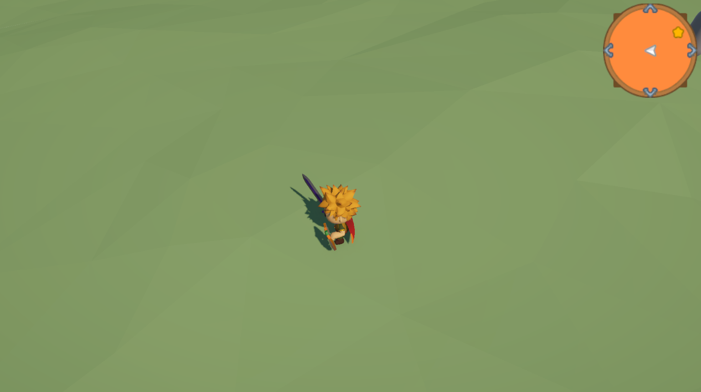
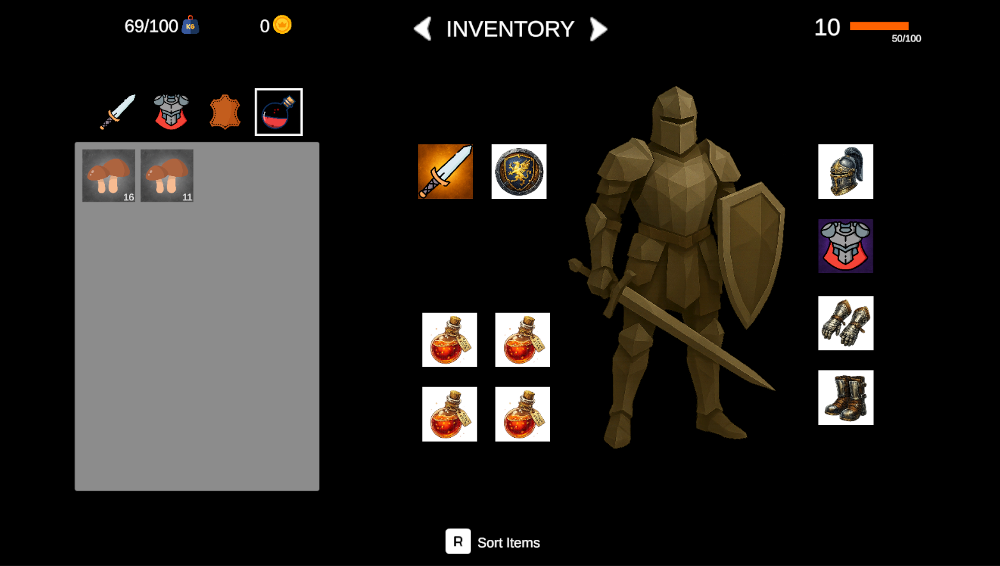
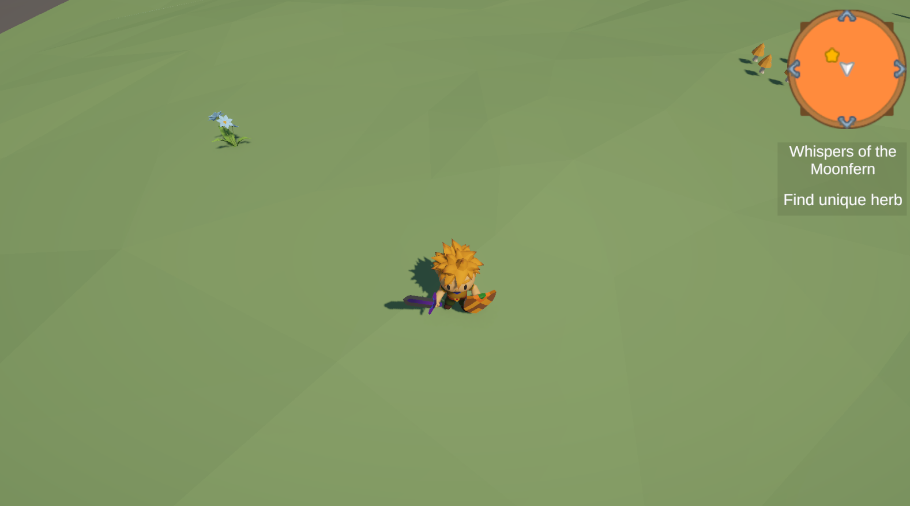

# RPG Game

An RPG game currently in development, focused on exploration, character progression and interconnected gameplay systems. The project is built with Unity and C#, with a strong focus on modular architecture and maintainable code.

# Main Features
## Inventory System

A modular inventory system for managing items collected by the player. The system is designed to support further expansion with different item types and gameplay interactions.

## Minimap System

A minimap system that helps players navigate the game world and keep track of their surroundings.

## State Machine

A flexible state machine architecture based on ScriptableObjects. State configurations are separated from the runtime state logic, allowing gameplay states to be configured and extended without tightly coupling them to the state machine implementation.

## Interaction Prompt System

A reusable interaction system that detects interactable objects and displays contextual prompts to the player.

## Quest System

A modular quest system currently in development. The system is designed to support different quest objectives, progression and interactions with the game world.

